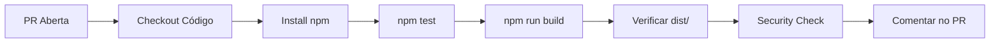
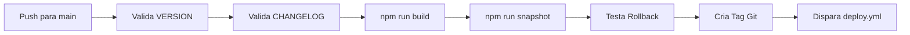
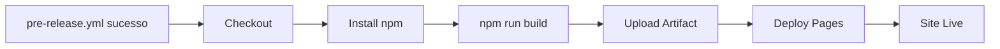

# 🚀 Workflow Guide - Versionamento & Deployment

Guia completo sobre como usar o sistema de CI/CD e versionamento implementado.

---

## 📊 Workflows Implementados

### 1. **pre-merge.yml** - Testes em Pull Requests
**Acionador**: Qualquer PR para `main`, `develop`, ou `feature/*`



**O que acontece**:
- ✅ Instala dependências
- ✅ Roda testes (se existirem)
- ✅ Compila aplicação
- ✅ Verifica arquivos críticos (index.html, sw.js)
- ✅ Valida segurança (sem secrets hardcoded)
- ✅ Comenta resultado no PR com checklist

**Tempo**: ~2-3 minutos

**Acesso ao resultado**:
1. Abra o PR no GitHub
2. Scroll para baixo → "Checks"
3. Clique em "Pre-Merge Checks" para ver logs completos

---

### 2. **pre-release.yml** - Validação Antes de Release
**Acionador**: Push para `main` que altera `VERSION`, `CHANGELOG.md`, ou `package.json`



**O que acontece**:
- ✅ Verifica VERSION em formato semântico (X.Y.Z)
- ✅ Confirma CHANGELOG.md menciona versão
- ✅ Constrói aplicação
- ✅ Cria snapshot automático
- ✅ Testa rollback (dry-run)
- ✅ Valida injeção de versão no service worker
- ✅ Cria tag git automaticamente (`vX.Y.Z`)
- ✅ Dispara workflow de deploy

**Tempo**: ~3-4 minutos

**Se falhar**:
1. Verifique os logs na aba "Actions" do PR
2. Corrija os problemas (ex: atualizar CHANGELOG)
3. Faça novo push para main
4. Workflow reinicia automaticamente

---

### 3. **deploy.yml** - Deploy para GitHub Pages
**Acionador**: Push para `main` (automático após pre-release bem-sucedido)



**O que acontece**:
- ✅ Compila aplicação com Vite
- ✅ Faz upload de `dist/` como GitHub Pages artifact
- ✅ GitHub Pages publica automaticamente
- ✅ Service worker cache é atualizado
- ✅ URL ao vivo em ~1-2 minutos

**URL**: https://mncprime.github.io/nutriflow/

**Tempo**: ~1-2 minutos (incluindo propagação CDN)

---

## 📋 Fluxo Completo: Do Código ao Deploy

### Passo 1: Desenvolver Feature

```bash
# 1. Crie branch de feature
git checkout develop
git checkout -b feature/sua-feature

# 2. Desenvolva, teste localmente
npm run dev
npm test
npm run build

# 3. Commit e push
git add .
git commit -m "feat: descrição clara da feature"
git push origin feature/sua-feature
```

### Passo 2: Pull Request & Testes Automáticos

```
No GitHub:
1. Crie PR: feature/sua-feature → develop
2. Espere pre-merge.yml completar (~3 min)
3. Revise o comentário automático do workflow
4. Se passou: aprove e faça merge
```

**O que o workflow fez**:
- ✅ Rodou testes
- ✅ Compilou código
- ✅ Verificou segurança
- ✅ Postou resultado no PR

### Passo 3: Merge para Develop (Staging)

```bash
# No GitHub: Clique "Merge pull request"
# Escolha "Squash and merge" ou "Create merge commit" (com --no-ff)

# Ou via CLI:
git checkout develop
git merge --no-ff feature/sua-feature
git push origin develop

# Deploy automático para staging (~1-2 min)
# URL: https://mncprime.github.io/nutriflow/ (branch develop)
```

### Passo 4: Release para Main (Produção)

#### 4a. Atualizar VERSION e CHANGELOG

```bash
# No seu editor:
1. Edite VERSION: 1.1.0 → 1.2.0 (exemplo: nova feature = MINOR)
2. Edite package.json: "version": "1.2.0"
3. Edite CHANGELOG.md:
   - Adicione seção [1.2.0]
   - Descreva features, bugfixes, breaking changes

# Commit
git add VERSION package.json CHANGELOG.md
git commit -m "release: bump version to 1.2.0"
```

#### 4b. Fazer PR para Main

```bash
# No GitHub:
1. Crie PR: develop → main
2. Descrição: "Release v1.2.0"
3. Espere pre-merge.yml passar

# Revise checklist no comentário do workflow
```

#### 4c. Merge para Main (com pré-release validation)

```bash
# No GitHub:
1. Clique "Merge pull request"
2. Espere pre-release.yml rodar (~4 min):
   - ✅ Valida VERSION/CHANGELOG
   - ✅ Cria snapshot
   - ✅ Testa rollback
   - ✅ Cria tag vX.Y.Z automaticamente

# Resultado: 3 workflows rodando:
# 1. pre-release.yml → validação
# 2. (automático) → deploy.yml
# 3. GitHub Pages deploy (~1 min)

# URL ao vivo: https://mncprime.github.io/nutriflow/
```

---

## 🔙 Usando Rollback (Se Algo Quebrar)

### Cenário: Problema em produção descoberto

```bash
# 1. Listar versões disponíveis
npm run rollback --list

# Saída:
# v1.2.0 (current broken)
#   Timestamp: 02/10/2026, 14:28:32
#   Commit: abc123f
#   Size: 395 KB
#
# v1.1.0 (previous working)
#   Timestamp: 01/10/2026, 10:15:00
#   Commit: def456e
#   Size: 390 KB

# 2. Restaurar versão anterior
npm run rollback v1.1.0

# Saída:
# ✅ dist/ restaurado
# ✅ VERSION atualizado para 1.1.0
# ✅ Git commit criado: "rollback: restore v1.1.0"

# 3. Verificar o que mudou
git log -1
git diff HEAD~1 dist/ | head -20

# 4. Enviar para produção
git push origin main

# → GitHub Pages redeploy (~1-2 min)
# → Service worker cache atualizado
# → Clientes baixam versão anterior

# Tempo total: ~3-5 minutos vs. ~30 min para debug + fix + test + deploy
```

### Rollback Dry-Run (Teste sem fazer mudanças)

```bash
npm run rollback v1.1.0 --dry-run

# Saída:
# [dry-run] Simulando rollback...
# ✅ Snapshot v1.1.0 pronto!
# [DRY-RUN] Nenhuma mudança foi feita.

# Nada foi alterado - seguro testar
```

---

## 📝 Guia de Versionamento

### Quando Usar Qual Versão?

- **PATCH** (1.1.1 → 1.1.2): Bugfixes críticos
  - Exemplo: Corrigir erro de cálculo, erro de CSS
  - Acionador: Bug descoberto em produção
  - Fluxo: hotfix/* → main (direto, sem develop)

- **MINOR** (1.1.0 → 1.2.0): Novas features
  - Exemplo: PDF extraction, novo algoritmo de marmitas
  - Acionador: Feature completada e testada
  - Fluxo: feature/* → develop → main

- **MAJOR** (1.0.0 → 2.0.0): Breaking changes
  - Exemplo: Novo modelo de dados, mudança de parser
  - Acionador: Mudança incompatível com versão anterior
  - Fluxo: feature/* → develop → main (com comunicado)

### Exemplo: Feature que muda cálculo

```
// Feature: Novo fator de cocção para proteína
VERSION: 1.0.0 → 1.1.0 (MINOR)
Reason: Nova feature, compatível com dados anteriores

CHANGELOG.md:
## [1.1.0] - 2024-10-XX
### Added
- Feature: Novo fator de proteína (0.75 → 0.80)
  - Mais preciso para carne magra
  - Aplicado a: Frango, Peixe, Carne Vermelha

### Breaking Changes
Nenhuma - dados anteriores reconvertidos automaticamente
```

---

## 🔍 Troubleshooting

### Workflow falhou: "VERSION format invalid"
**Causa**: VERSION não está em formato X.Y.Z

```bash
# Corrija:
echo "1.1.0" > VERSION
git add VERSION
git commit -m "fix: correct VERSION format"
git push origin main
```

### Workflow falhou: "CHANGELOG.md doesn't mention version"
**Causa**: CHANGELOG não foi atualizado

```bash
# Adicione ao topo do CHANGELOG.md:
## [1.1.0] - 2024-10-02
### Added
- Feature X
- Feature Y
### Fixed
- Bug Z

git add CHANGELOG.md
git commit -m "docs: update CHANGELOG for v1.1.0"
git push origin main
```

### Workflow falhou: "Build failed"
**Causa**: Erro de compilação

```bash
# Teste localmente:
npm run build

# Corrija o erro
git add .
git commit -m "fix: build error in [file]"
git push origin main
```

### Rollback falhou: "Backup not found"
**Causa**: Snapshot não foi criado para essa versão

```bash
# Verificar snapshots disponíveis:
ls -la .backups/

# Se backup estiver corrompido:
npm run snapshot --quiet  # Criar novo
npm run rollback v1.1.0
```

---

## 📊 Monitoramento

### Ver status de todos os workflows

```
GitHub Actions → Seu repositório

Aba "Actions" mostra:
✅ Latest workflows (verde = sucesso)
❌ Failed workflows (vermelho = erro)
⏳ Running workflows (amarelo = em progresso)
```

### Ver logs de um workflow específico

```
1. Clique no workflow na aba "Actions"
2. Clique no job (ex: "Checks & Build")
3. Expanda etapas para ver logs detalhados
4. Procure por ❌ ou ⚠️ para identificar problemas
```

### Verificar deployment em produção

```bash
# 1. Abra o site
https://mncprime.github.io/nutriflow/

# 2. DevTools → Application → Service Workers
# Verificar cache name: "nutriflow-1.1.0"

# 3. Console → nenhum erro
# 4. Test uma funcionalidade crítica

# 5. Se problema: executar rollback
npm run rollback v1.0.0
git push origin main
```

---

## 📚 Referências Rápidas

### Comandos Git (Releases)

```bash
# Ver tags existentes
git tag -l

# Ver commits desde tag anterior
git log v1.0.0..v1.1.0 --oneline

# Ver diff de uma versão
git diff v1.0.0 v1.1.0 -- dist/sw.js
```

### Comandos npm (Versionamento)

```bash
npm run build              # Compila (injeta VERSION)
npm run snapshot           # Cria backup
npm run snapshot --dry-run # Simula sem guardar
npm run rollback --list    # Lista versões
npm run rollback vX.Y.Z    # Restaura versão
npm run rollback vX.Y.Z --dry-run  # Simula
```

### Arquivos Importantes

```
VERSION                    # Versão atual (X.Y.Z)
package.json              # version deve match VERSION
CHANGELOG.md              # Histórico de releases
VERSIONING.md             # Documentação técnica completa
.backups/vX.Y.Z/          # Snapshots para rollback
.github/workflows/        # Workflows CI/CD
```

---

## ✅ Checklist: Primeiro Release

Antes de fazer seu primeiro release com este sistema:

- [ ] Verificou que VERSION está em formato X.Y.Z?
- [ ] CHANGELOG.md tem entrada para a versão?
- [ ] package.json tem version igual a VERSION?
- [ ] Rodou `npm test` localmente (passa)?
- [ ] Rodou `npm run build` (sem erros)?
- [ ] Testou em mobile/dark mode?
- [ ] Criou PR → develop (pre-merge workflow passou)?
- [ ] Criou PR → main com CHANGELOG/VERSION atualizados?
- [ ] Pre-release workflow passou (viu tag criada)?
- [ ] Site ao vivo em https://mncprime.github.io/nutriflow/?
- [ ] Testou pelo menos uma funcionalidade principal?

Se tudo passou: 🎉 **Release bem-sucedido!**

---

**Última atualização**: Phase 3 Complete  
**Versão do guia**: 1.0  
